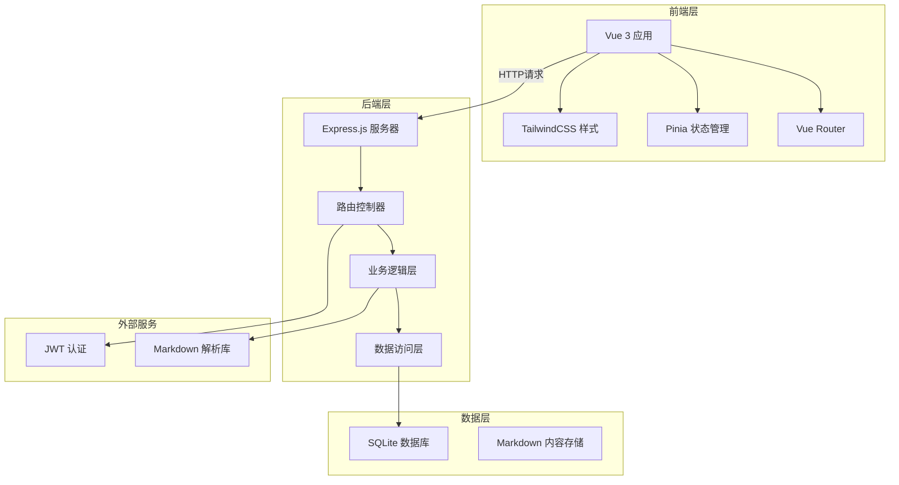
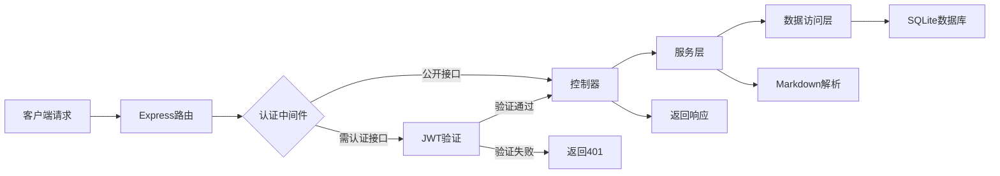
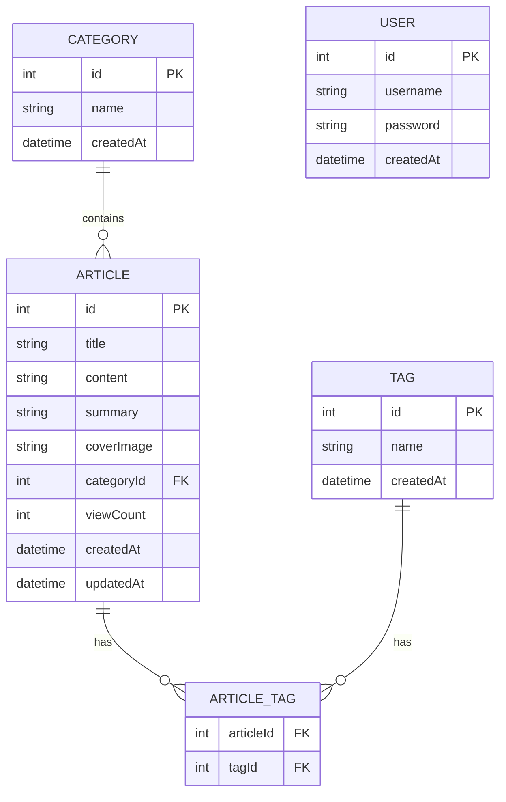

# 个人博客网站技术架构文档

## 1. 架构设计



## 2. 技术说明

- **前端框架**: Vue 3 + TypeScript + Composition API
- **构建工具**: Vite
- **路由管理**: Vue Router 4
- **状态管理**: Pinia
- **样式方案**: TailwindCSS 3
- **后端框架**: Express.js 4
- **数据库**: SQLite (轻量级，适合个人博客)
- **ORM**: Prisma 或 Sequelize (推荐Prisma，类型安全)
- **认证**: JWT (JSON Web Token)
- **Markdown解析**: marked 或 markdown-it
- **代码高亮**: highlight.js
- **初始化模板**: vue-express-ts

## 3. 路由定义

### 3.1 前端路由

| 路由 | 页面 | 说明 |
|------|------|------|
| / | Home | 首页，文章列表 |
| /article/:id | ArticleDetail | 文章详情页 |
| /category/:name | CategoryPage | 分类页面 |
| /tag/:name | TagPage | 标签页面 |
| /about | About | 关于页面 |
| /search | Search | 搜索结果页 |
| /admin/login | AdminLogin | 管理员登录 |
| /admin/dashboard | AdminDashboard | 管理后台仪表盘 |
| /admin/articles | AdminArticles | 文章管理列表 |
| /admin/articles/new | AdminArticleNew | 新建文章 |
| /admin/articles/edit/:id | AdminArticleEdit | 编辑文章 |
| /admin/categories | AdminCategories | 分类管理 |
| /admin/tags | AdminTags | 标签管理 |

## 4. API 定义

### 4.1 文章相关

```typescript
// 获取文章列表
GET /api/articles
Query Params: page, limit, category, tag, search

// 响应
{
  data: Array<{
    id: number;
    title: string;
    summary: string;
    content: string;
    coverImage: string | null;
    categoryId: number;
    category: { id: number; name: string };
    tags: Array<{ id: number; name: string }>;
    createdAt: string;
    updatedAt: string;
    viewCount: number;
  }>;
  total: number;
  page: number;
  limit: number;
}

// 获取文章详情
GET /api/articles/:id
响应: { data: Article }

// 创建文章 (需要认证)
POST /api/articles
Body: {
  title: string;
  content: string;
  summary?: string;
  coverImage?: string;
  categoryId: number;
  tagIds: number[];
}

// 更新文章 (需要认证)
PUT /api/articles/:id
Body: 同创建

// 删除文章 (需要认证)
DELETE /api/articles/:id
```

### 4.2 分类相关

```typescript
// 获取所有分类
GET /api/categories
响应: { data: Array<{ id: number; name: string; articleCount: number }> }

// 创建分类 (需要认证)
POST /api/categories
Body: { name: string }

// 更新分类 (需要认证)
PUT /api/categories/:id
Body: { name: string }

// 删除分类 (需要认证)
DELETE /api/categories/:id
```

### 4.3 标签相关

```typescript
// 获取所有标签
GET /api/tags
响应: { data: Array<{ id: number; name: string; articleCount: number }> }

// 创建标签 (需要认证)
POST /api/tags
Body: { name: string }

// 更新标签 (需要认证)
PUT /api/tags/:id
Body: { name: string }

// 删除标签 (需要认证)
DELETE /api/tags/:id
```

### 4.4 认证相关

```typescript
// 管理员登录
POST /api/auth/login
Body: { username: string; password: string }
响应: { token: string; user: { id: number; username: string } }

// 验证Token
GET /api/auth/verify
Headers: Authorization: Bearer <token>
```

## 5. 服务器架构图



## 6. 数据模型

### 6.1 数据模型定义



### 6.2 数据定义语言

```sql
-- 创建用户表
CREATE TABLE users (
  id INTEGER PRIMARY KEY AUTOINCREMENT,
  username VARCHAR(50) UNIQUE NOT NULL,
  password VARCHAR(255) NOT NULL,
  createdAt DATETIME DEFAULT CURRENT_TIMESTAMP
);

-- 创建分类表
CREATE TABLE categories (
  id INTEGER PRIMARY KEY AUTOINCREMENT,
  name VARCHAR(50) UNIQUE NOT NULL,
  createdAt DATETIME DEFAULT CURRENT_TIMESTAMP
);

-- 创建标签表
CREATE TABLE tags (
  id INTEGER PRIMARY KEY AUTOINCREMENT,
  name VARCHAR(30) UNIQUE NOT NULL,
  createdAt DATETIME DEFAULT CURRENT_TIMESTAMP
);

-- 创建文章表
CREATE TABLE articles (
  id INTEGER PRIMARY KEY AUTOINCREMENT,
  title VARCHAR(200) NOT NULL,
  content TEXT NOT NULL,
  summary TEXT,
  coverImage VARCHAR(500),
  categoryId INTEGER NOT NULL,
  viewCount INTEGER DEFAULT 0,
  createdAt DATETIME DEFAULT CURRENT_TIMESTAMP,
  updatedAt DATETIME DEFAULT CURRENT_TIMESTAMP,
  FOREIGN KEY (categoryId) REFERENCES categories(id)
);

-- 创建文章标签关联表
CREATE TABLE article_tags (
  articleId INTEGER NOT NULL,
  tagId INTEGER NOT NULL,
  PRIMARY KEY (articleId, tagId),
  FOREIGN KEY (articleId) REFERENCES articles(id) ON DELETE CASCADE,
  FOREIGN KEY (tagId) REFERENCES tags(id) ON DELETE CASCADE
);

-- 创建索引
CREATE INDEX idx_articles_category ON articles(categoryId);
CREATE INDEX idx_articles_created ON articles(createdAt DESC);
CREATE INDEX idx_article_tags_article ON article_tags(articleId);
CREATE INDEX idx_article_tags_tag ON article_tags(tagId);

-- 插入初始数据
INSERT INTO users (username, password) VALUES ('admin', '$2b$10$...'); -- 密码需加密
INSERT INTO categories (name) VALUES ('技术'), ('生活'), ('随笔');
INSERT INTO tags (name) VALUES ('Vue'), ('TypeScript'), ('Node.js'), ('前端'), ('思考');
```
